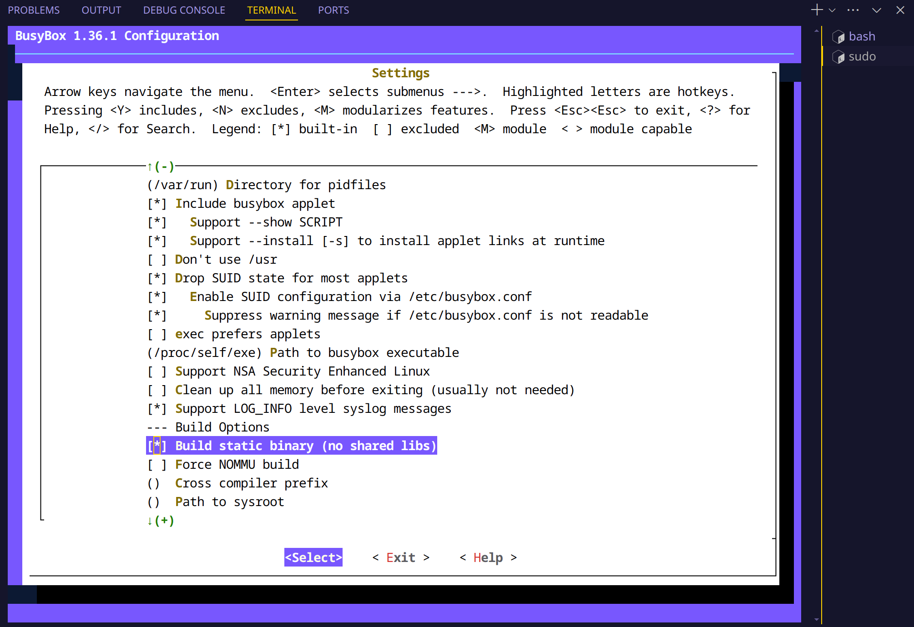
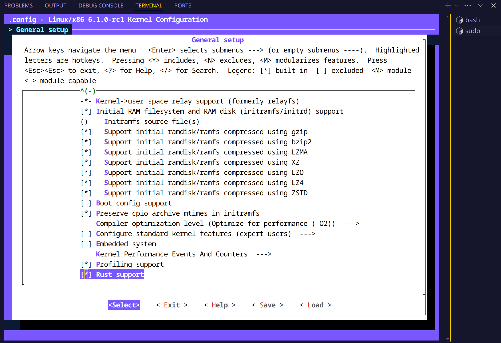

# Building Busybox & Kernel

To build Busybox and the Linux kernel, follow these steps:

## Step 0: Install Ubuntu 22.04

I use Arch Linux. So to setup the Ubuntu 22.04, I use `systemd-nspawn` to create a container and install Ubuntu 22.04 inside it.

The following step is in the directory which contains the content of [the repository](https://github.com/cicvedu/cicv-r4l-3-xforcevesa).

```bash
wget http://cdimage.ubuntu.com/ubuntu-base/releases/22.04/release/ubuntu-base-22.04-base-amd64.tar.gz
mkdir ubuntu-base-22.04-base-amd64
cd ubuntu-base-22.04-base-amd64
tar xvf ../ubuntu-base-22.04-base-amd64.tar.gz
cd ..
sudo systemd-nspawn --bind=.:/mnt  -D ./ubuntu-base-22.04-base-amd64/
```

## Step 1: Install Required Packages

```bash
sudo apt-get update
sudo apt-get install build-essential ncurses-dev bison flex bc
sudo apt install git curl
sudo apt install build-essential libtool texinfo gzip zip unzip patchutils cmake ninja-build automake bison flex gperf grep sed gawk bc zlib1g-dev libexpat1-dev libmpc-dev libncurses-dev libglib2.0-dev libfdt-dev libpixman-1-dev libelf-dev libssl-dev
sudo apt-get install clang-format clang-tidy clang-tools clang clangd libc++-dev libc++1 libc++abi-dev libc++abi1 libclang-dev libclang1 liblldb-dev libllvm-ocaml-dev libomp-dev libomp5 lld lldb llvm python3-clang
```

## Step 2: Install Rust

```bash
curl --proto '=https' --tlsv1.2 -sSf https://sh.rustup.rs | sh
```

## Step 3: Build Busybox

```bash
cd /mnt/busybox-1.36.1/
make menuconfig
# Set the following config to yes
# General setup
#         ---> [*] Rust support
make install -j$(nproc)
```




Then obtain the busybox binary in `/mnt/busybox-1.36.1/_install`.

## Step 4: Install Linux Kernel Build Essentials

```bash
cd ../linux
sudo apt install qemu-system-x86
qemu-system-x86_64 --version
rustup toolchain install $(scripts/min-tool-version.sh rustc)

# 将此目录中的rustc重置为特定版本
# 可提前为rustup设置代理，以便加速下载过程，参考上一节“安装Rust”中的说明
rustup override set $(scripts/min-tool-version.sh rustc)
# 添加rust-src源代码
rustup component add rust-src
# 安装clang llvm，该项一般在配置内核时已经安装，若已安装此处可忽略
apt install clang llvm

# 可为cargo仓库crates.io设置使用镜像，参考上一节“安装Rust”中的说明
# 安装bindgen工具，注意在0.60版本后，bindgen工具的命令行版本位于bindgen-cli包中
cargo install --locked --version $(scripts/min-tool-version.sh bindgen) bindgen
# 安装rustfmt和clippy
rustup component add rustfmt
rustup component add clippy
# 检查内核rust支持已经启用
make LLVM=1 rustavailable
```

## Step 5: Build Linux Kernel

```bash
make x86_64_defconfig
make LLVM=1 menuconfig
# Set the following config to yes
# General setup
#         ---> [*] Rust support
make LLVM=1 -j$(nproc)
```



Then obtain the kernel binary in `/mnt/linux/arch/x86/boot/bzImage` and kernel image in `/mnt/linux/arch/x86/boot/compressed/vmlinux`.
