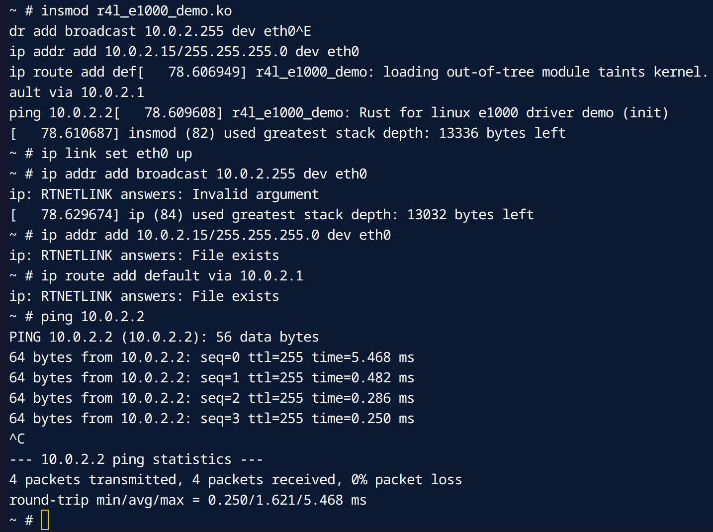

# Build Linux Bootable Image & Setup Network

## Questions & Answers

## Questions

在该文件夹中调用make LLVM=1，该文件夹内的代码将编译成一个内核模块。请结合你学到的知识，回答以下两个问题：
1、编译成内核模块，是在哪个文件中以哪条语句定义的？
2、该模块位于独立的文件夹内，却能编译成Linux内核模块，这叫做out-of-tree module，请分析它是如何与内核代码产生联系的？

In this directory, running make LLVM=1 will compile the code into a kernel module. Based on what you have learned, please answer the following two questions:

1. Where and with which statement is the kernel module defined?
2. This module is located in a separate directory but can be compiled into a Linux kernel module. This is called an out-of-tree module. Please analyze how it is linked to the kernel code.

## Answers

1. Where and with which statement is the kernel module defined?
- `config` statement in `Kconfig` file.
- `tristate` statement in `Kconfig` file.
```
config [C MACRO]
	tristate [DISPLAY NAME]
```

2. This module is located in a separate directory but can be compiled into a Linux kernel module. This is called an out-of-tree module. Please analyze how it is linked to the kernel code.
- The module is compiled separately using the `make` command.
- The module is linked to the kernel code using the `make modules_install` command.
- When the kernel is compiled, the `make` command is executed to build the kernel, and also it builds the modules.

## Step 0: Setup Environment

Before doing this you should have done everything in [this section](./01-busybox-kernel.md) and have entered the Ubuntu environment.

## Step 1: Install Dependencies

```bash
sudo apt-get update
sudo apt-get install -y cpio
```

## Step 2: Build Linux Bootable Image & Bootstrap

```bash
cd src_e1000
bash build_image.sh
```

## Step 3: Configure Network

After entering the QEMU Linux tty, do this:

```bash
insmod r4l_e1000_demo.ko
ip link set eth0 up
ip addr add broadcast 10.0.2.255 dev eth0
ip addr add 10.0.2.15/255.255.255.0 dev eth0 
ip route add default via 10.0.2.1
ping 10.0.2.2
```

If you see ping responses, then you have successfully configured the network.



## Step 4: Exit QEMU

You can exit the QEMU Linux tty by pressing `Ctrl-A X`.
