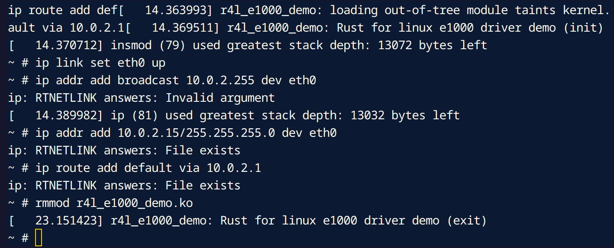

# Write Code to Remove the Rust Module

## Step 1: Write Module Code

Add the following code to the `r4l_e1000_demo.rs` file:

```rust
impl driver::DeviceRemoval for E1000DrvPrvData {
    fn device_remove(&self) {
        pr_err!("Rust for linux e1000 driver demo (device_remove)\n");
    }
}
```

## Step 2: Run It

```bash
bash build_image.sh
# In QEMU Linux, After loading the module
rmmod r4l_e1000_demo.ko
dmesg
```


