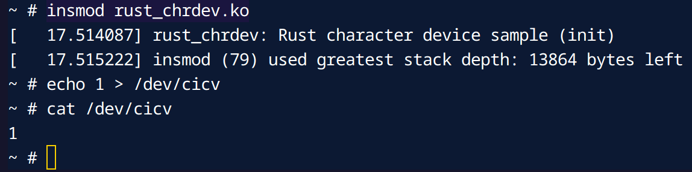

# Create a Character Device

## Step 1: Implement Read and Write Functions

```rust
impl file::Operations for RustFile {
    type Data = Box<Self>;

    fn open(_shared: &(), _file: &file::File) -> Result<Box<Self>> {
        Ok(
            Box::try_new(RustFile {
                inner: &GLOBALMEM_BUF
            })?
        )
    }

    fn write(this: &Self, _file: &file::File, reader: &mut impl IoBufferReader, offset: u64) -> Result<usize> {
        let offset = offset.try_into()?;
        let mut vec = this.inner.lock();
        let len = core::cmp::min(reader.len(), vec.len().saturating_sub(offset));
        reader.read_slice(&mut vec[offset..][..len])?;
        Ok(len)
    }

    fn read(this: &Self, _file: &file::File, writer: &mut impl IoBufferWriter, offset: u64) -> Result<usize> {
        let offset = offset.try_into()?;
        let vec = this.inner.lock();
        let len = core::cmp::min(writer.len(), vec.len().saturating_sub(offset));
        writer.write_slice(&vec[offset..][..len])?;
        Ok(len)
    }
}
```

Rebuild the kernel.

## Step 2: Create a Device File

In the QEMU Linux environment:

```bash
insmod rust_chrdev.ko
echo 1 > /dev/cicv
cat /dev/cicv
```


