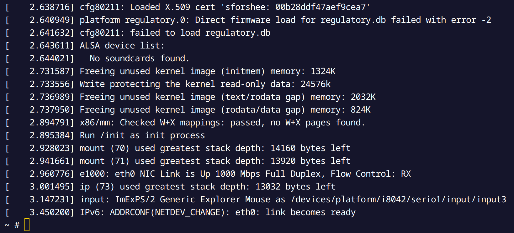
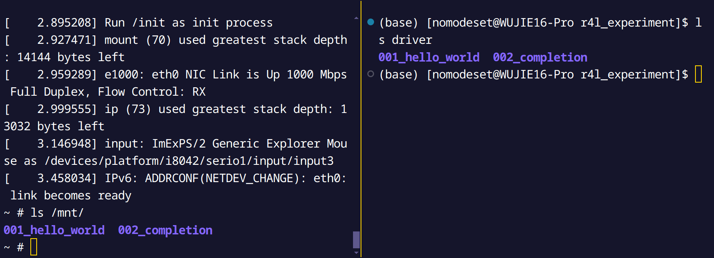
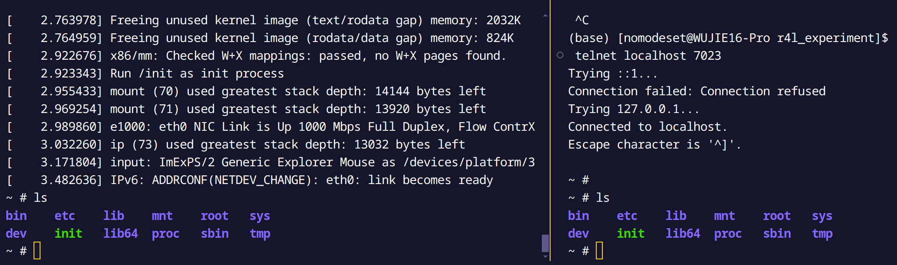

# Linux Network Experiments

## Step 1: Code a Build Script

As shown [here](../r4l_experiment/build.sh)

Run it!



## Step 2: Setup NFS

I use Arch Linux, so I followed the instructions [here](https://wiki.archlinux.org/index.php/NFS#Server_configuration) to set up NFS.

```bash
sudo pacman -S nfs-utils
export R4L_EXP=$PWD
sudo bash -c "echo \
    '$R4L_EXP/driver     127.0.0.1(insecure,rw,sync,no_root_squash)' \
    >> /etc/exports"
sudo systemctl enable --now rpcbind.service
sudo systemctl enable --now nfs-server.service
```

Add the following line to `init.sh`:

```bash
mount -t nfs -o nolock host_machine:$R4L_EXP/driver /mnt
```

Run the experiment and check if the driver is mounted.



What we mount to `/mnt` is the driver directory on the host machine.

## Step 3: Setup Telnet

Add the following lines to `build.sh`:

```bash
mkdir dev/pts
mknod -m 666 dev/ptmx c 5 2
# 同样在init脚本中设置自动挂载，在NFS设置后面加入
mount -t devpts devpts  /dev/pts
# 然后rebuild initramfs
cd $R4L_EXP/initramfs
```

Add the following line to `init.sh`:

```bash
# 同样在init脚本中设置自动挂载，在NFS设置后面加入
mount -t devpts devpts  /dev/pts
mknod -m 666 dev/ptmx c 5 2
# 同样在init脚本中设置自动启动，在telnetserver设置后面加入
telnetd -l /bin/sh  -p 23
```

And add the following parameters to the QEMU:

```bash
-netdev user,id=host_net,hostfwd=tcp::7023-:23 \
-device e1000,mac=52:54:00:12:34:50,netdev=host_net 
```


