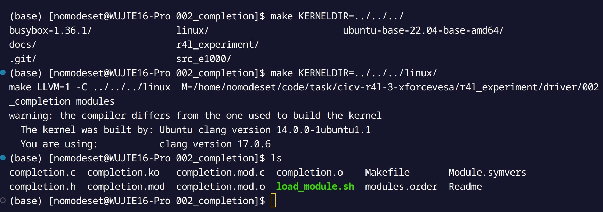
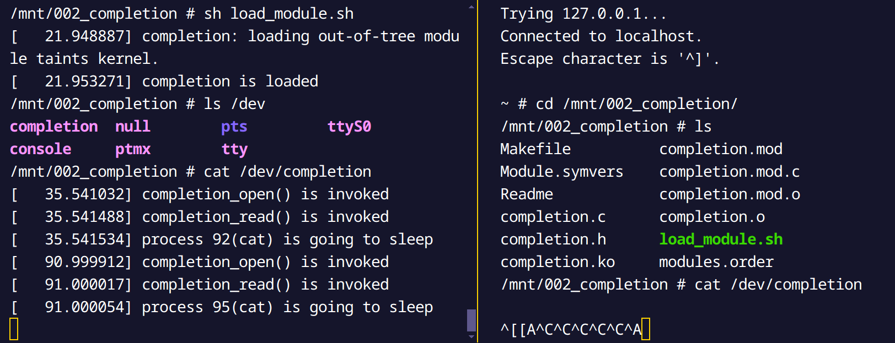
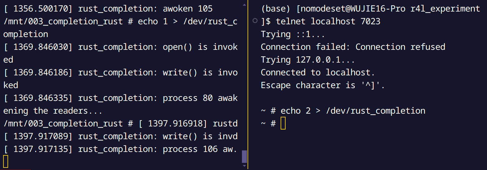

# Linux Network Experiments

## Step 1: Code a Build Script

As shown [here](../r4l_experiment/build.sh)

Run it!


## Step 2: Setup NFS

I use Arch Linux, so I followed the instructions [here](https://wiki.archlinux.org/index.php/NFS#Server_configuration) to set up NFS.

```bash
sudo pacman -S nfs-utils
export R4L_EXP=$PWD
sudo bash -c "echo \
    '$R4L_EXP/driver     127.0.0.1(insecure,rw,sync,no_root_squash)' \
    >> /etc/exports"
sudo systemctl enable --now rpcbind.service
sudo systemctl enable --now nfs-server.service
```

Add the following line to `init.sh`:

```bash
mount -t nfs -o nolock host_machine:$R4L_EXP/driver /mnt
```

Run the experiment and check if the driver is mounted.


What we mount to `/mnt` is the driver directory on the host machine.

## Step 3: Setup Telnet

Add the following lines to `build.sh`:

```bash
mkdir dev/pts
mknod -m 666 dev/ptmx c 5 2
# 同样在init脚本中设置自动挂载，在NFS设置后面加入
mount -t devpts devpts  /dev/pts
# 然后rebuild initramfs
cd $R4L_EXP/initramfs
```

Add the following line to `init.sh`:

```bash
# 同样在init脚本中设置自动挂载，在NFS设置后面加入
mount -t devpts devpts  /dev/pts
mknod -m 666 dev/ptmx c 5 2
# 同样在init脚本中设置自动启动，在telnetserver设置后面加入
telnetd -l /bin/sh  -p 23
```

And add the following parameters to the QEMU:

```bash
-netdev user,id=host_net,hostfwd=tcp::7023-:23 \
-device e1000,mac=52:54:00:12:34:50,netdev=host_net 
```


## Step 4: Rust Modules

In host:

```bash
cd $R4L_EXP/driver/002_completion
make KERNELDIR=../../../linux/
```



In QEMU Linux:

```bash
cd /mnt/002_completion
sh load_module.sh
cat /dev/completion
```



Re-write it in `r4l_experiment/driver/003_completion_rust`:

- `Kbuild`:

```bash
obj-m := rust_completion.o
```

- `rust_completion.rs`:

```rust
// SPDX-License-Identifier: GPL-2.0

//! Rust character device sample.

use core::result::Result::Err;

use kernel::prelude::*;
use kernel::sync::Mutex;
use kernel::{chrdev, file};
use kernel::io_buffer::IoBufferWriter;
use kernel::io_buffer::IoBufferReader;
use kernel::task::Task;

const GLOBALMEM_SIZE: usize = 0x1000;

module! {
    type: RustChrdev,
    name: "rust_completion",
    author: "xforcevesa",
    description: "Rust character device sample",
    license: "GPL",
}

static GLOBALMEM_BUF: Mutex<[u8;GLOBALMEM_SIZE]> = unsafe {
    Mutex::new([0u8;GLOBALMEM_SIZE])
};

struct RustFile {
    #[allow(dead_code)]
    inner: &'static Mutex<[u8;GLOBALMEM_SIZE]>,
}

#[vtable]
impl file::Operations for RustFile {
    type Data = Box<Self>;

    fn open(_shared: &(), _file: &file::File) -> Result<Box<Self>> {
        pr_info!("open() is invoked\n");
        Ok(
            Box::try_new(RustFile {
                inner: &GLOBALMEM_BUF
            })?
        )
    }

    fn write(this: &Self, _file: &file::File, reader: &mut impl IoBufferReader, offset: u64) -> Result<usize> {
        pr_info!("write() is invoked\n");

        let task = Task::current();

        pr_info!(
            "process {} awakening the readers...\n",
            task.pid()
        );
        let offset = offset.try_into()?;
        let mut vec = this.inner.lock();
        let len = core::cmp::min(reader.len(), vec.len().saturating_sub(offset));
        reader.read_slice(&mut vec[offset..][..len])?;
        
        Ok(len)
    }

    fn read(this: &Self, _file: &file::File, writer: &mut impl IoBufferWriter, offset: u64) -> Result<usize> {
        pr_info!("read() is invoked\n");

        let task = Task::current();

        pr_info!(
            "process {} is going to sleep\n",
            task.pid()
        );
        let offset = offset.try_into()?;
        let vec = this.inner.lock();
        let len = core::cmp::min(writer.len(), vec.len().saturating_sub(offset));
        writer.write_slice(&vec[offset..][..len])?;
        pr_info!(
            "awoken {}\n",
            task.pid()
        );
        Ok(len)
    }
}

struct RustChrdev {
    _dev: Pin<Box<chrdev::Registration<2>>>,
}

impl kernel::Module for RustChrdev {
    fn init(name: &'static CStr, module: &'static ThisModule) -> Result<Self> {
        pr_info!("completion_example is loaded\n");

        let mut chrdev_reg = chrdev::Registration::new_pinned(name, 0, module)?;

        // Register the same kind of device twice, we're just demonstrating
        // that you can use multiple minors. There are two minors in this case
        // because its type is `chrdev::Registration<2>`
        chrdev_reg.as_mut().register::<RustFile>()?;
        chrdev_reg.as_mut().register::<RustFile>()?;

        Ok(RustChrdev { _dev: chrdev_reg })
    }
}

impl Drop for RustChrdev {
    fn drop(&mut self) {
        pr_info!("completion_example is unloaded\n");
    }
}
```


- `Makefile`:

```makefile
KDIR ?= ../../../linux/

# Build Rust for Linux Module
LLVM?= 1

ifeq ($(LLVM), 1)
    RUSTC_FLAGS := $(RUSTC_FLAGS) -C opt-level=2 -C lto
endif

# Build the Rust kernel module
$(KDIR)/build:
	@echo Building Rust kernel module...
	$(MAKE) LLVM=$(LLVM) -C $(KDIR) M=$$PWD	
```

- Build it:

```bash
make
```

- Load it in QEMU Linux:

```bash
cd /mnt/003_completion_rust
sh load_module.sh
```

- Test it:

```bash
echo 1 > /dev/completion
cat /dev/completion
```




