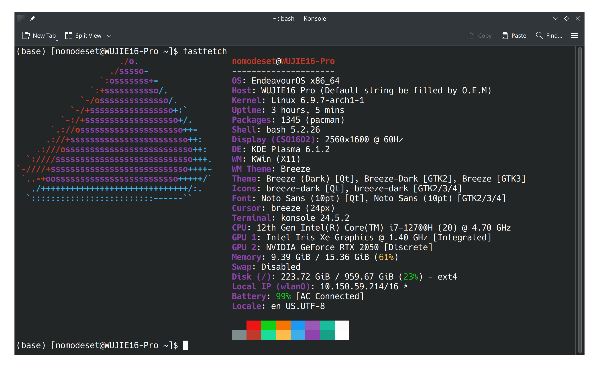
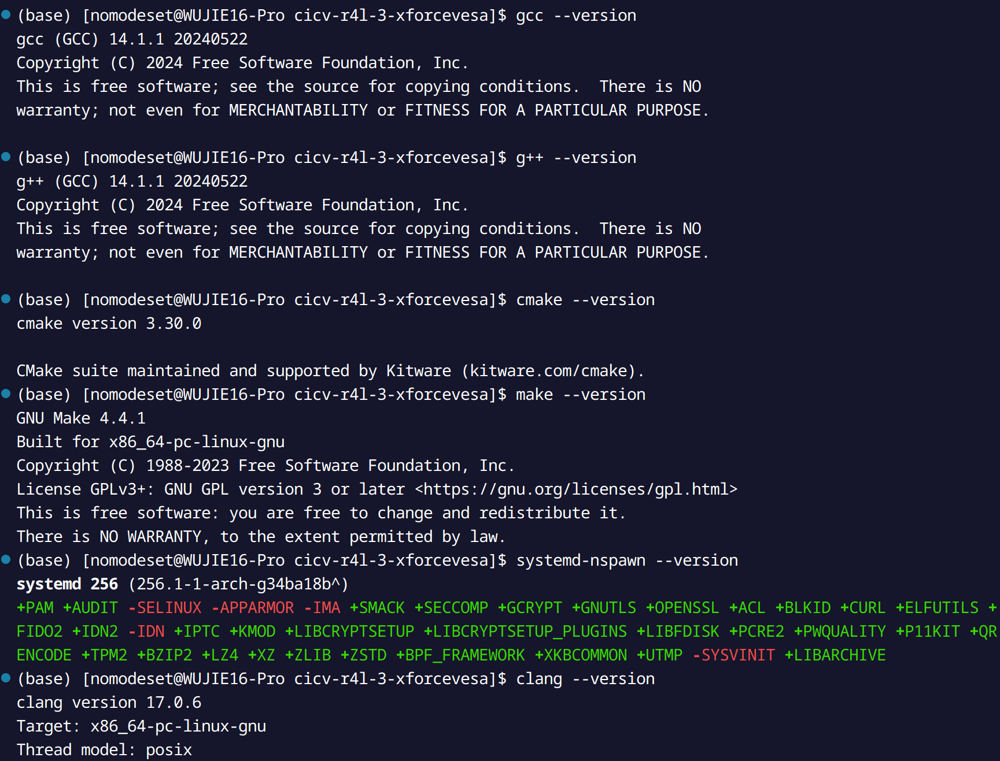
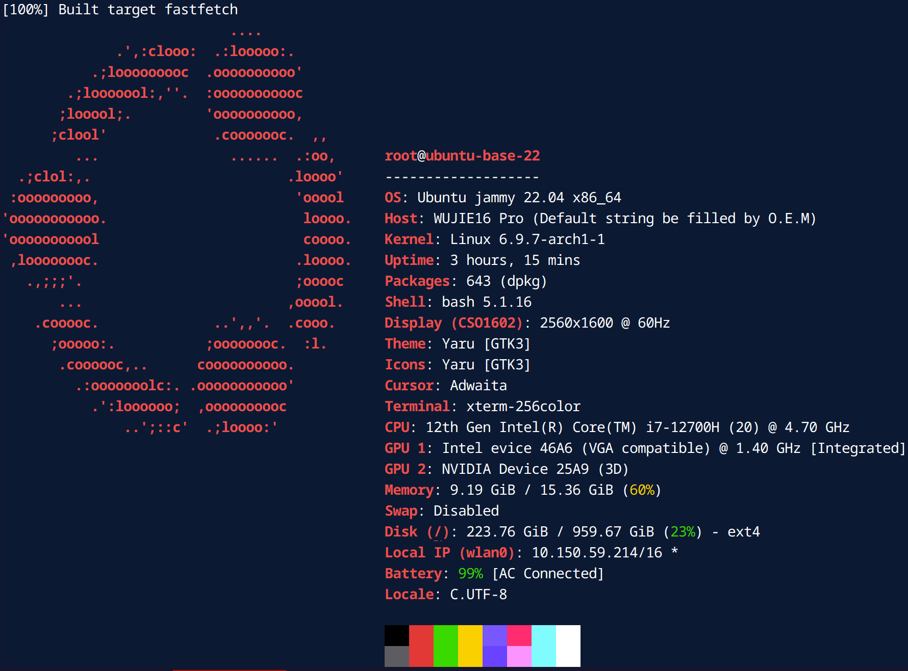

# Documentation

## Synopsis

The following content is in Chinese.

至此，本人完成了自动驾驶OS集训营的第三周`Rust for Linux`实验的所有内容，一切成果均可复现。

通过本实验，本人对Linux内核的配置、编写内核模块、驱动开发等方面有了一定的了解，并掌握了Rust编写简单内核模块的能力，此处为本人[学习记录与感言](./07-notes.md)。

同时本人以**第一名**的成绩通过了`rustlings`的挑战，排行榜[点击这里](https://cicvedu.github.io/rust-rustlings-semester-4-ranking/)，本人ID为`xforcevesa`，欢迎大家来交流学习。

## 实验环境

### 宿主机环境





- 系统环境：`Endeavour OS`, based on `Arch Linux`, kernel version `6.9.7-arch1-1`
- 工具链：
    - gcc/g++: 14.1.1
    - cmake: 3.30.0
    - make: 4.4.1
    - clang: 17.0.6
    - systemd-nspawn: 256.1-1

### Ubuntu容器环境

- 由于本人本机为`Arch Linux`，因此在宿主机上使用`systemd-nspawn`安装`Ubuntu`容器环境，以便于进行实验。



- 启动参数：
```bash
sudo systemd-nspawn --bind=.:/mnt -D ./ubuntu-base-22.04-base-amd64/
```
- 系统环境：`Ubuntu 22.04`
- 工具链：
    - gcc/g++: 11.4.0
    - cmake: 3.22.1
    - make: 4.3
    - clang: 14.0.0
    - rustup: 1.27.1
    - rustc: 1.79.0

## 作业完成情况

### 作业1：编译Linux内核

- [文档在此](./01-busybox-kernel.md)
- 完成情况：已经成功安装和配置了BusyBox，并编译和加载了自定义的Linux内核，能够熟练地使用BusyBox命令，并理解了内核模块的基本操作。

### 作业2：对Linux内核进行一些配置

- [文档在此](./02-linux-network.md)
- 完成情况：网络接口配置、路由与转发、驱动构建等任务已经全部完成。掌握了Linux系统中网络配置的基本技能，并能够解决一些常见的网络问题。

### 作业3：使用rust编写一个简单的内核模块并运行

- [文档在此](./03-hacking-kernel.md)
- 完成情况：编写了一个简单的内核模块，能够在系统启动时打印一段信息，并在日志中打印一些信息。掌握了Rust语言的基本语法，并能够熟练地使用Rust进行系统编程。

### 作业4：为e1000网卡驱动添加remove代码
- [文档在此](./04-remove-module.md)
- 完成情况：为Rust驱动模块添加了drop方法，以便于模块销毁时释放资源。掌握了Rust的生命周期管理机制，并能够熟练地编写驱动模块。

### 作业5：注册字符设备
- [文档在此](./05-char-device.md)
- 完成情况：编写了一个字符设备驱动，能够接收输入，并将其打印到控制台。掌握了Linux字符设备驱动的基本知识，并能够熟练地编写驱动模块。

### 项目小试验
- [文档在此](./06-linux-network-exmeriments.md)
- 完成情况：
  1. 环境配置：环境搭建成功，根据文档撰写了一个[自动化构建脚本](../r4l_experiment/build.sh)，可自动化构建，并在脚本中启用了NFS与TCP/Telnet，启动时可挂载。
  2. 实战要求：实现了[002_completion](../r4l_experiment/driver/002_completion/)的Rust重构版，位置在[此处](../r4l_experiment/driver/003_completion_rust/)，可`make`构建，并加载，完成类似功能。
